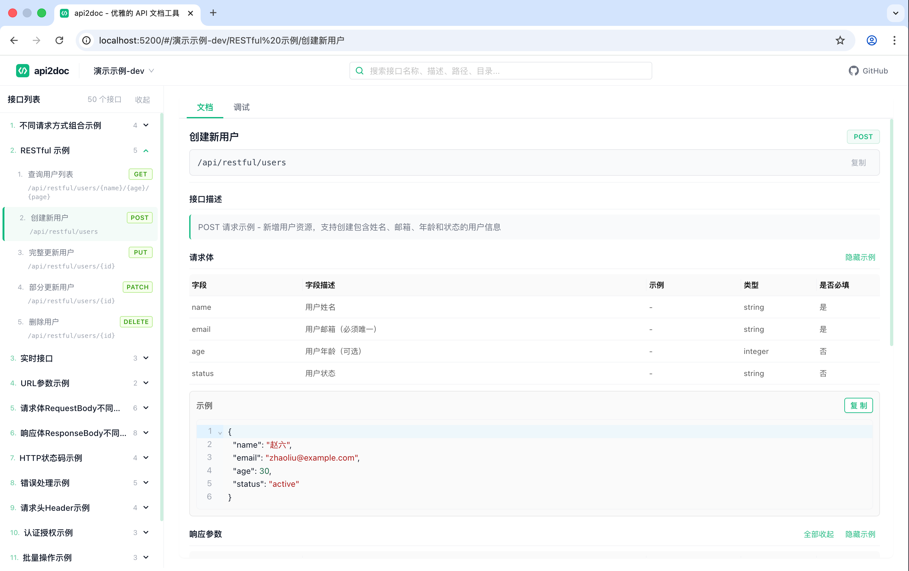
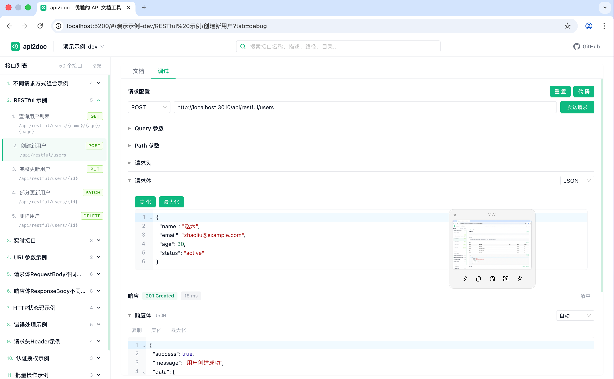
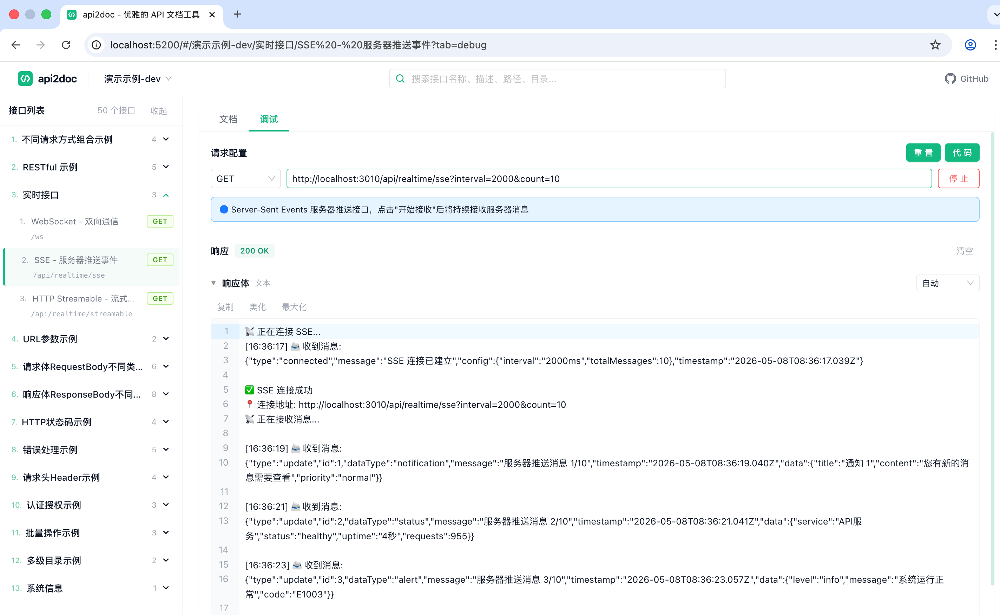

# api2doc

美观、易用的 API 文档查看器，Swagger UI 的现代替代方案。

业界大量项目使用 Swagger/OpenAPI 管理接口文档，但默认 UI 体验粗糙（十分难用），所以我写了这个项目。


api2doc 提供更友好的交互和阅读体验：
- 对大模型友好，支持 SSE / HTTP Streamable 协议
- 支持 WebSocket 协议
- 支持多项目、多 Swagger URL 统一管理
- 内置本地代理，免去浏览器跨域配置

## 快速使用

```bash
# 需要提前安装nodejs运行环境
npx api2doc
```

启动后自动打开浏览器，点击右上角 `+` 打开服务管理，添加你的 Swagger/OpenAPI JSON 地址即可。

## 命令行选项

```bash
npx api2doc                   # 默认端口 5200，自动打开浏览器
npx api2doc --port 8080       # 自定义端口
```

## 功能

- 美观的 API 文档展示，支持多级目录分组
- 交互式 API 调试（通过本地代理转发请求）
- 内置代理，无需后端配置 CORS
- 多服务管理：添加、编辑、删除、搜索、切换
- 配置导入/导出，方便换浏览器或分享给团队
- 支持 Swagger 2.0 和 OpenAPI 3.0/3.1
- 搜索过滤、代码示例生成

## 预览截图




## 服务管理

点击左上角当前服务名称或右上角 `+` 按钮，打开服务管理弹窗：

- **添加** - 填写名称和 OpenAPI JSON 地址
- **编辑** - hover 服务条目，点击编辑图标
- **删除** - hover 服务条目，点击删除图标
- **切换** - 点击服务条目即可切换
- **搜索** - 按名称或地址过滤服务列表
- **导入/导出** - JSON 格式，方便迁移和团队共享

数据存储在浏览器 localStorage 中，刷新不丢失。

## 工作原理

`npx api2doc` 在本地启动一个轻量 Node.js 服务：

1. 提供前端静态页面
2. `/proxy?url=xxx` - 代理转发 OpenAPI JSON 请求（解决跨域）
3. `/proxy/api` - 代理转发 API 调试请求

所有请求通过本地代理中转，不存在跨域问题。

## 常见 OpenAPI 地址

| 框架 | 地址 |
|------|------|
| Spring Boot 3.x (springdoc) | `http://localhost:8080/v3/api-docs` |
| Spring Boot 2.x (springfox) | `http://localhost:8080/v2/api-docs` |
| FastAPI | `http://localhost:8000/openapi.json` |
| Express + swagger-jsdoc | `http://localhost:3000/api-docs.json` |
| NestJS | `http://localhost:3000/api-json` |
| ASP.NET Core | `http://localhost:5000/swagger/v1/swagger.json` |
| Gin (Go) | `http://localhost:8080/swagger/doc.json` |

## 开发

```bash
pnpm install        # 安装依赖
pnpm dev            # 启动 Vite 开发服务器（端口 5200）
pnpm build          # 构建前端产物到 dist/
pnpm serve          # 本地测试 CLI 模式（端口 5200）
```

### 本地开发说明

项目包含两部分：前端（根目录）和后台 API 示例服务（`api/` 目录）。

`api/` 是一个基于 Express + Swagger 的接口示例服务，用于本地开发和调试时提供真实的 OpenAPI 数据源。

#### 启动步骤

1. 启动后台 API 服务：

```bash
cd api
pnpm install        # 首次需要安装依赖
pnpm dev            # 启动 API 服务（端口 3010）
```

启动后可访问：
- Swagger UI：http://localhost:3010/api-docs
- OpenAPI JSON：http://localhost:3010/openapi.json

2. 启动前端开发服务器（另开终端）：

```bash
pnpm dev            # 启动 Vite 开发服务器（端口 5200）
```

或使用根目录的快捷命令同时启动 API 服务：

```bash
pnpm dev:api        # 仅启动 API 服务
```

3. 在浏览器中打开 http://localhost:5200，添加 `http://localhost:3010/openapi.json` 作为服务地址即可联调。

#### 前后端联调

前端 Vite 开发服务器内置了代理插件（见 `vite.config.ts` 中的 `devProxyPlugin`），提供 `/proxy` 和 `/proxy/api` 接口，与生产环境 CLI 模式行为一致。所有对外部 API 的请求都通过本地代理转发，无需额外配置 CORS。

#### 目录结构

```
api/
├── config/          # 配置（端口、CORS、Swagger 定义）
├── middleware/      # 中间件（日志、错误处理）
├── routes/          # 路由模块（按功能拆分）
├── public/          # 静态文件
├── uploads/         # 上传文件存储
└── server.js        # 入口文件
```

## 技术栈

- 前端：Vue 3 + TypeScript + Ant Design Vue + CodeMirror
- 后台示例：Express + swagger-jsdoc + swagger-ui-express
- CLI：Node.js 原生 http + sirv（唯一运行时依赖，~20KB）
- 构建：Vite

## 发布

```bash
pnpm install        # 安装依赖
pnpm build          # 构建前端
npm publish         # 发布到 npm
```

发布后用户通过 `npx api2doc` 即可使用，无需全局安装。

## License

MIT
